# Бинарный транслятор RXcc

Данный проект представляет из себя аналог компилятора, транслирующий код, написанный на моем языке программирования (подробнее в проекте [Programming_language](https://github.com/Raptor-X102/Programming-language)) в [мой ассемблер](https://github.com/Raptor-X102/Processor), в nasm и сразу в x86-64.

## Формат и флаги компиляции

| Флаг 	| Описание                                                                                                  	|
|------	|-----------------------------------------------------------------------------------------------------------	|
| -s   	| Source flag, отвечает за исходный файл с кодом                                                            	|
| -a   	| Asm flag, далее файл, в который будет записан <br>скомпилированный в nasm код                                 	|
| -d   	| Debug flag, далее .dot файл для работы с graphviz <br>для отладки в виде дерева                               	|
| -Ma  	| My asm flag, далее файл в который будет записан <br>скомпилированный в мой ассемблер код                      	|
| -o   	| Exe flag, далее имя выходного файла. Для корректной работы <br>без расширения либо с расширениями exe или cpp 	|

Пример вызова
```
RXcc.exe -s Solve_quad_eq.txt -a First_exe.asm -d Lang_debug.dot -o First_exe -Ma My_asm1.asm
```

## Правила для корректного использования

Обязательно должна быть папка [In_out_modules](https://github.com/Raptor-X102/Bin_translator/tree/main/In_out_modules). Это ключевой файл для генерации exe-файла. Также необходим компилятор g++ 14.2.0 (возможно, даже необходимо иметь реализацию Rev3, Built by MSYS2 project, поскольку не гарантируется, что скомпилированный код на других реализациях в некоторых случаях будет совпадать). В противном случае работоспособность не гарантируется.

## Особенности реализации

Для того, чтобы компилировать код сразу в x86-64, необходимо генерировать exe-файл. Проект писался на windows 11, поэтому разобраться в том, как генерировать пролог и эпилог файла не было возможности. Для этого пришлось бы разбираться в том, как работает CRT инициализация/деинициализация, менять все относительные адреса после генерации и так далее. Поэтому было принято решение облегчить задачу, генерируя exe-файл нужного размера спомощью компилятора g++. Об этом далее.
Основной файлы, генерирующий x86-64 код - Backend_funcs_x64.cpp и Backend_funcs_x64.h. Запись инструкций происходит в динамический массив (директория [Dynamic_array](https://github.com/Raptor-X102/Bin_translator/tree/main/libs/Dynamic_array)) с помощью различный макросов. После того, как весь код записан, генерируется cpp-файл [In_out_mod.cpp](https://github.com/Raptor-X102/Bin_translator/blob/main/In_out_modules/In_out_mod.cpp) на основе исходного файла [In_out_modules.cpp](https://github.com/Raptor-X102/Bin_translator/blob/main/In_out_modules/In_out_modules.cpp). В него записывается количество ассемблерных вставок иструкции nop, равное размеру скомпилированного кода. Далее этот файл компилируется в исполняемый файл. В него вставляется скомпилированный код и получается на выходе exe-файл вашего кода, написанного на моем языке.

### Более тонкие нюансы исполнения

1. Все вычисления реализованы на стеке.
2. Все операции с числами с плавающей точкой.
3. Из-за того, что инструкция comisd (сравнивание двух 64-битных чисел с плавающей точкой) работает как беззнаковое, то все условные jump-инструкции работают в пределах 128 инструкций. Поэтому для работы с более длинным кодом, реализована промежуточная безуслованая jmp инструкция, работающая уже со смещениями на адресаию в 32 бита.
4. Ограничение по размеру кода в скомпилированном виде - 2^16 инструкций. Это связано с генерацией exe-файла. Не проблема увеличить этот размер, но для корретной работы в данной версии реализован этот размер.
5. Внутреннее соглашение о вызове:
Все параметры функции передаются через стек. Push происходит начиная с последнего параметра. Далее после call заносится адрес возврата. Пролог функции начинатеся с push rbp. После этого в стек заносятся локальные переменные.
Наглядное представление стека
стековый фрейм вызывающей функции

```
параметр n
параметр n-1
...
параметр 1
адрес возврата
rbp
локальная переменная 1
локальная переменная 2
...
локальная переменная k
```

Такое соглашение о вызовах было принято в связи с тем, что проще всего передавать параметры через стек. В windows calling conventions принято выделять еще теневой стек, дополнительный 32 байта либо под первые 4 аргумента, которые передаются через регистры, либо для отладки. Поэтому было принято решение оптимизировать это место. Также удобно разделять локальные переменные и передваемые параметры.
6. Перед каждым вызовом функции для выравнивания стека на 16 (для корректной работы с xmm-регистрами) вызывается 1 из двух вспомогательных функций check_alignment (even, odd; их реализация в [Backend_funcs_nasm.cpp](https://github.com/Raptor-X102/Bin_translator/blob/main/src/Backend_funcs_nasm.cpp) и [Backend_funcs_x64.cpp](https://github.com/Raptor-X102/Bin_translator/blob/main/src/Backend_funcs_x64.cpp)) в зависимости от числа параметров у вызываемой функции.
7. Расположение функций разработчика относительно main не важно: пользователь может вставлять их как до, так и после. Это реальизовано с помощью самой первой инструкции - jmp main.

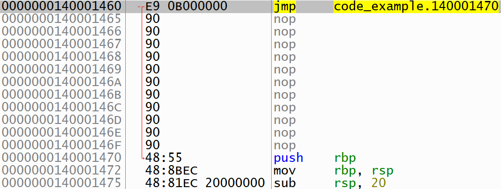

## Генерация кода из AST

В данном разделе подробнее рассмотрим как в функции [Backend_funcs_x64.cpp](https://github.com/Raptor-X102/Bin_translator/blob/main/src/Backend_funcs_x64.cpp) и [Backend_funcs_nasm.cpp](https://github.com/Raptor-X102/Bin_translator/blob/main/src/Backend_funcs_nasm.cpp) транслируют код.
Все примеры основаны на программах в [examples/Input_data](https://github.com/Raptor-X102/Bin_translator/tree/main/examples/Input_data). Если скомпилировать их с debug-фдагом "-d", создадутся AST ([examples/Debug](https://github.com/Raptor-X102/Bin_translator/tree/main/examples/Debug)).

Теперь передйем к деталям реализации. Разбирать будем сверху вниз дерева, т.е. от корня к листьям.

Замечание: далее будут диаграммы с частями AST. Они изменены для более наглядного представления и содержат меньше нужной для отладки информации. Поэтому реальные будут отличаться от этих.

## Объявление и реализация функции пользователя
Пример из [Solve_quad_eq_dbg.png](https://github.com/Raptor-X102/Bin_translator/tree/main/examples/Debug/Solve_quad_eq_dbg.png).

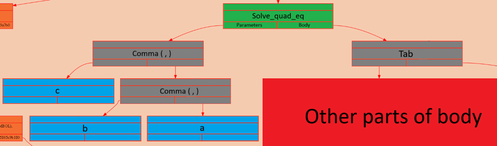

Параметры всегда распалагаются в летвой ветке названия функции, подвязываются за разделительные запятые. Тело находится в правой ветке.

<details>
<summary>Основная часть Compile_user_function_def_x64</summary>

```c

    INSERT_NOPS(d_array_code, Code_alignment - (d_array_code->size % Code_alignment));     // выравнивание

    func_list->func_data[index].func_rel32_address = d_array_code->size;       // Заносим относительный адрес функции
    int32_t stack_frame = (func_list->func_data[index].local_vars.var_list_size +
                            (func_list->func_data[index].local_vars.var_list_size % 2))* Value_size; // рассчитываем стековый
                                                                                                    //  фрейм функции
    PUSH_REG(d_array_code, I_RBP);
    MOV_REG_REG(d_array_code, I_RBP, I_RSP);                        // Пролог функции
    SUB_REG_IMM(d_array_code, I_RSP, stack_frame);

    if (!Compile_operation_x64(d_array_code, d_array_funcs, root->right_node, func_list, index))     // Переходим к телу функции
        return false;

```
</details>

Каждая функция выравнивается до адреса, кратного 16. Это делается, во-первых из-за соглашения в Windows, во-вторых, для большей скорости, в-третьих, для работы с xmm-регистрами, которые требуют этого. Поскольку основной exe-файл генерируется gcc компилятором, то гарантируется, что функция main выровнена как минимум на 16. Поэтому мы в праве рассчитывать относительно main выравнивание.
Дизассемблер пролога

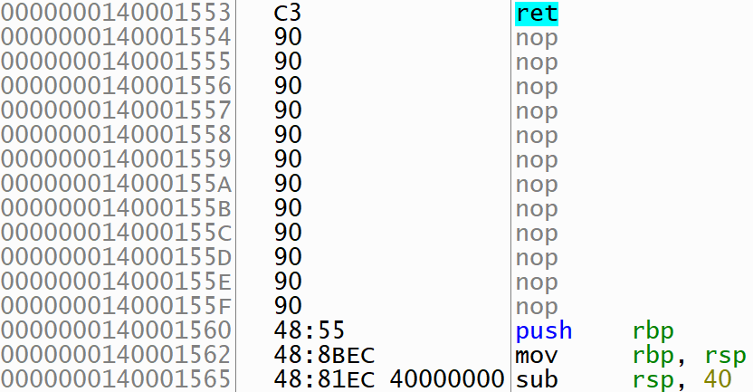

Как мы видим, адрес выровнен на 16.

## Операции
Операциями в логике моего языка являются:
1. Ветвления (if)
2. Цикл (while)
3. Присваивание (=)
4. Вызов функции
5. Возращение из функции (return)

<details>
<summary>Основная часть Compile_operation_x64</summary>

```c

    if (tmp_data->value == IF && tmp_data->expression_type == KEY_WORD) {

        if (!Compile_if_x64(d_array_code, d_array_funcs, root, func_list, index))
            return false;
    }

    else if (tmp_data->value == WHILE && tmp_data->expression_type == KEY_WORD) {

        if (!Compile_while_x64(d_array_code, d_array_funcs, root, func_list, index))
            return false;
    }

    else if (tmp_data->value == ASSIGNMENT && tmp_data->expression_type == SPECIAL_SYMBOL) {

        if (!Compile_assignment_x64(d_array_code, d_array_funcs, root, func_list, index))
            return false;
    }

    else if (tmp_data->expression_type == FUNCTION) {

        if (!Compile_user_function_x64(d_array_code, d_array_funcs, root, func_list, index))
            return false;
    }

    else if (tmp_data->value == RETURN && tmp_data->expression_type == KEY_WORD) {

        if (!Compile_return_x64(d_array_code, d_array_funcs, root, func_list, index))
            return false;
    }

    else {

        DEBUG_PRINTF("ERROR: unknown operation\n");
        return false;
    }

```
</details>

Некоторые из них корректнее называть операторами, но под оператором у меня подразумевается наивысший приоритет исполненияю. Разберем их.

### Операторы
В логике RXcc это все то, что возвращает числовое значение.
1. Числовая константа
Положить в стек 64-битное число без выделения памяти в секциях bss и data можно следующим способом, используя регистр.
<details>
<summary>Показать реализацию</summary>

```c

else if (tmp_data->expression_type == NUM) {

    double tmp_double = 0;
    memcpy(&tmp_double, &tmp_data->value, sizeof(double));
    MOV_REG_IMM64(d_array_code, I_RDX, tmp_double);
    PUSH_REG(d_array_code, I_RDX);
}

```
</details>

Прмер трансляции будет в пункте 3.
2. Переменная (параметр или локальная)

<details>
<summary>Показать реализацию</summary>

```c

else if (tmp_data->expression_type == VAR) {

    Variable_data* var_data = NULL;
    memcpy(&var_data, &tmp_data->value, sizeof(Variable_data*));
    int64_t var_index = Find_variable(&func_list->func_data[index].local_vars,
                                      var_data->var_name, var_data->var_len);

    if (var_index == -1) {

        var_index = Find_variable(&func_list->func_data[index].parameters,
                                  var_data->var_name, var_data->var_len);
        if (var_index == -1) {

            DEBUG_PRINTF("ERROR: variable '%.*s' was not found\n", var_data->var_len, var_data->var_name);
            return false;
        }

        disp32 = (var_index + 2)* 8;    // +2 due to return address & rbp in stack
        PUSH_RBP_DISP32(d_array_code, disp32);
    }

    else {

        disp32 = -((var_index + 1)* 8);    // +1 due to return address in stack
        PUSH_RBP_DISP32(d_array_code, disp32);
    }
}

```
</details>

Переменная ищестя по имени в списках параметров функции и локальных переменных. В зависимости от этого бдует расчитан ее местоположение в стеке (ранее было описан принцип хранения параметров и переменных в стеке). Пример трансляции в следующем пункте.

3. Основные математические функции (бинарные - сложение, вычитание, умножение, деление; унарные - корень, модуль)

<details>
<summary>Показать реализацию</summary>

```c

if (tmp_data->expression_type == OP) {

    if (root->left_node)
        if (!Compile_operator_x64(d_array_code, d_array_funcs, root->left_node, func_list, index))
            return false;

    if (root->right_node)
        if (!Compile_operator_x64(d_array_code, d_array_funcs, root->right_node, func_list, index))
            return false;

    disp32 = 0;
    imm32 = Value_size;

    switch (tmp_data->value) {

        #define FUNC_BIN(value, symbol) case value: {\
                                            MOVSD_XREG_MEM_DISP0(d_array_code, I_XMM0, I_RSP);\
                                            ADD_REG_IMM(d_array_code, I_RSP, imm32);\
                                            MOVSD_XREG_MEM_DISP0(d_array_code, I_XMM1, I_RSP);\
                                            value##SD_XREG_XREG(d_array_code, I_XMM1, I_XMM0);\
                                            break;\
                                        }

        #define FUNC_UN(value, symbol) case value: {\
                                            MOVSD_XREG_MEM_DISP0(d_array_code, I_XMM1, I_RSP);\
                                            value##SD_XREG_XREG(d_array_code, I_XMM1, I_XMM1);\
                                            break;\
                                       }


        #include "Funcs_code_gen_x64.h"
        #undef FUNC_BIN
        #undef FUNC_UN

        case ABS: {

            MOVSD_XREG_MEM_DISP0(d_array_code, I_XMM1, I_RSP);
            MOV_REG_IMM64(d_array_code, I_RDX, Double_sign_mask);
            PUSH_REG(d_array_code, I_RDX);
            MOVSD_XREG_MEM_DISP0(d_array_code, I_XMM0, I_RSP);
            ADD_REG_IMM(d_array_code, I_RSP, imm32);
            ANDPD_XREG_XREG(d_array_code, I_XMM1, I_XMM0);
            break;
        }

        default:
            DEBUG_PRINTF("ERROR: no such function\n");
            return false;
    }

    MOVSD_MEM_XREG_DISP0(d_array_code, I_RSP, I_XMM1);
}

```
</details>

Здесь реализована кодогенерация, подробнее в файле [Funcs_code_gen_x64.h](https://github.com/Raptor-X102/Bin_translator/blob/main/headers/Funcs_code_gen_x64.h).

Если операция бинарная, с вершины стека берется второй операнд, а затем первый. В унарной операции Берется только одно значение.
Модуль реализован следующим образом: с вершины стека берется значение, во второй операнд кладестя маска (Double_sign_mask = 0x7FFFFFFFFFFFFFFF). Она обнуляет старший знаковый бит функцией andpd.

Примеры из [Solve_quad_eq_dbg.png](https://github.com/Raptor-X102/Bin_translator/tree/main/examples/Debug/Solve_quad_eq_dbg.png).

Бинарные функции:

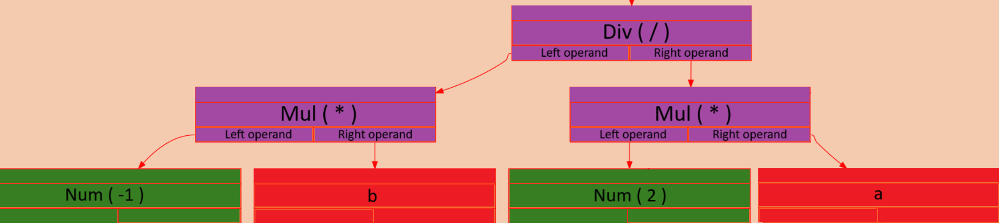

Пример трансляции (0xBFF0000000000000 = -1; 0x4000000000000000 = 2)

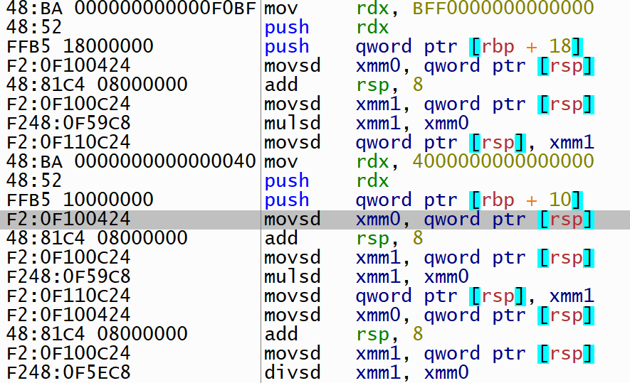

Унарная функция (корень):

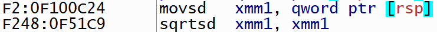

Модуль:

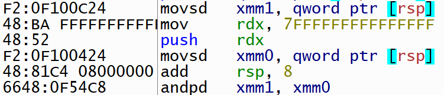

4. Вызов функции

Прежде чем мы приступим к рассмотрению функций, необходимо объяснить реализацию всех инструкций jxx (прыжки) и call (вызовы).
 Если прыжок происходит вперед, то мы заведомо при компиляции не знаем, куда точно нам нужно прыгнуть. Поэтому помимо основного динамического массива d_array_code есть массив d_array_funcs. В него записываются данные следующим образом: сначала кладется смещение (4 байта) относительно начала массива d_array_code и к нему прибавляется то количество байт, которое нужно для кодирования самого опкода инструкции прыжка до относительного адреса (пример: call rel32 кодируется E8 xx xx xx xx, т.е. нужно прибавить 1 байт опкода call); после этого пропускается 4 байта - выделяется место под индекс. Индекс определяется в зависимости от того, на что совершается прыжок. Место в d_array_funcs в которое нужно положить индекс сохраняется и передается в нужную функцию. Когда компилятор дошел до того места, когда известно, куда должен совершаться прыжок, он по сохраненному адресу в массиве d_array_funcs кладет индекс. Если это прыжок на какую-то часть кода в функции (if, while), то кладется текущий адрес относительно начала d_array_code со знаком минус (это нужно для различения). Если это был вызов функции, то кладется ее индекс в массиве функций (Func_data_list* func_list). Для стандартнх функций специальные значения.
 С прыжками назад все проще, поскольку мы уже знаем адрес, куда будет совершаться прыжок.

 Теперь перейдем к функциям.

Функции делятся на два типа: пользовательские и стандартные. Ко вторым относятся функции Out (printf) и In (scanf).
<details>
<summary>Показать реализацию Out</summary>

```c

if (!strncmp(var_data->var_name, "Out", var_data->var_len)) {

    int32_t disp32 = 0, imm32 = 56;
    int parameters_pushed = 0;
    Compile_push_parameters_x64(d_array_code, d_array_funcs, root->left_node, func_list, index, &parameters_pushed);
    if (parameters_pushed != 1) {

        DEBUG_PRINTF("ERROR: in func 'Out' wrong arguments amount\n");
        return false;
    }
    MOVSD_XREG_MEM_DISP0(d_array_code, I_XMM1, I_RSP);
    MOV_REG_MEM_DISP0(d_array_code, I_RDX, I_RSP);
    SUB_REG_IMM(d_array_code, I_RSP, imm32); // need to allocate 64 bytes = 32 (shadow space) + 32 (space for xmm0-xmm3),
                                                // but 8 bytes already allocated (pushed as a parameter), so 56 bytes
    //disp32 = 0x18;
    //MOVSD_MEM_XREG_DISP0(d_array_code, I_RSP, I_XMM0, ); // windows calling conventions for debug, (not used)
    int64_t imm64 = 1;
    MOV_REG_IMM64(d_array_code, I_RAX, imm64);
    uint32_t fill_address = d_array_code->size + 3; // before we put lea, + 3 lea byte
    Dynamic_array_push_back(d_array_funcs, &fill_address, sizeof(uint32_t));
    Dynamic_array_push_back(d_array_funcs, &Format_string_pf_addr_index, sizeof(int32_t));

    LEA_REG_RIP_REL32(d_array_code, I_RCX, No_jmp_rel32);

    fill_address = d_array_code->size + 1; // before we put call, + 1 call instr byte
    Dynamic_array_push_back(d_array_funcs, &fill_address, sizeof(uint32_t));
    Dynamic_array_push_back(d_array_funcs, &Printf_func_index, sizeof(int32_t));

    CALL_REL32(d_array_code, No_jmp_rel32);

    imm32 = 64;
    ADD_REG_IMM(d_array_code, I_RSP, imm32);
}

```
</details>

<details>
<summary>Показать реализацию In</summary>

```c

else if (!strncmp(var_data->var_name, "In", var_data->var_len)) {

    int32_t disp32 = 0, imm32 = 64;
    SUB_REG_IMM(d_array_code, I_RSP, imm32);

    uint32_t fill_address = d_array_code->size + 3; // before we put lea, + 3 lea byte
    Dynamic_array_push_back(d_array_funcs, &fill_address, sizeof(uint32_t));
    Dynamic_array_push_back(d_array_funcs, &Format_string_sf_addr_index, sizeof(int32_t));
    LEA_REG_RIP_REL32(d_array_code, I_RCX, No_jmp_rel32);

    /*********Get parameter***********************************/
    if (!root->left_node) {

        DEBUG_PRINTF("ERROR: in func 'In' wrong arguments amount\n");
        return false;
    }

    memcpy(&tmp_data, &root->left_node->node_data, sizeof(Node_data*));
    Variable_data* var_data = NULL;
    memcpy(&var_data, &tmp_data->value, sizeof(Variable_data*));
    int64_t var_index = Find_variable(&func_list->func_data[index].local_vars,
                                    var_data->var_name, var_data->var_len);

    if (var_index == -1) {

        var_index = Find_variable(&func_list->func_data[index].parameters,
                                var_data->var_name, var_data->var_len);
        if (var_index == -1) {

            DEBUG_PRINTF("ERROR: variable '%.*s' was not found\n", var_data->var_len, var_data->var_name);
            return false;
        }

        disp32 = (var_index + 2)* 8;    // +1 due to return address & RBP in stack
        LEA_REG_MEM(d_array_code, I_RDX, I_RBP, disp32);
    }

    else {

        disp32 = -((var_index + 1)* 8);    // +1 due to return address in stack
        LEA_REG_MEM(d_array_code, I_RDX, I_RBP, disp32);
    }
    /************************************************************** */

    fill_address = d_array_code->size + 1; // before we put call, + 1 call instr byte
    Dynamic_array_push_back(d_array_funcs, &fill_address, sizeof(uint32_t));
    Dynamic_array_push_back(d_array_funcs, &Scanf_func_index, sizeof(int32_t));
    CALL_REL32(d_array_code, No_jmp_rel32);

    ADD_REG_IMM(d_array_code, I_RSP, imm32);
}

```
</details>

<details>
<summary>Показать реализацию пользовательской функции</summary>

```c

else {

    int64_t callee_index = Find_func_data(func_list, &var_data);
    if (callee_index == -1) {

        DEBUG_PRINTF("ERROR: '%.*s' function was not found\n", (size_t) var_data->var_len, var_data->var_name);
        return false;
    }

    Variable_data check_alignment = {};
    int64_t parameters = (func_list->func_data[callee_index].parameters.free_var);
    if (!(parameters % 2)) {

        check_alignment.var_name = strdup(Check_alignment_even);
        check_alignment.var_len = sizeof(Check_alignment_even) - 1;
    }

    else {

        check_alignment.var_name = strdup(Check_alignment_odd);
        check_alignment.var_len = sizeof(Check_alignment_odd) - 1;
    }

    Variable_data* check_alignment_ptr = &check_alignment;
    int64_t check_alignment_index = Find_func_data(func_list, &check_alignment_ptr);
    if (check_alignment_index == -1) {

        DEBUG_PRINTF("ERROR: 'check_alignment_ptr' function was not found\n");
        return false;
    }

    uint32_t fill_address = d_array_code->size + 1; // before we put jmp instr, + 1 call byte
    Dynamic_array_push_back(d_array_funcs, &fill_address, sizeof(uint32_t));
    Dynamic_array_push_back(d_array_funcs, &check_alignment_index, sizeof(int32_t));
    CALL_REL32(d_array_code, No_jmp_rel32);
    SUB_REG_REG(d_array_code, I_RSP, I_RBX);

    int parameters_pushed = 0;
    Compile_push_parameters_x64(d_array_code, d_array_funcs, root->left_node, func_list, index, &parameters_pushed);

    fill_address = d_array_code->size + 1; // before we put jmp instr, + 1 call byte
    Dynamic_array_push_back(d_array_funcs, &fill_address, sizeof(uint32_t));
    Dynamic_array_push_back(d_array_funcs, &callee_index, sizeof(int32_t));
    CALL_REL32(d_array_code, No_jmp_rel32);

    ADD_REG_REG(d_array_code, I_RSP, I_RBX);

    if (Value_size*(parameters-1))
        ADD_REG_IMM(d_array_code, I_RSP, Value_size*(parameters-1)); // need -1 to push into stack returning value

    int32_t disp32 = 0;
    MOVSD_MEM_XREG_DISP0(d_array_code, I_RSP, I_XMM0);
}

```
</details>

Блоки по типу

```c
fill_address = d_array_code->size + 1; // before we put call, + 1 call instr byte
Dynamic_array_push_back(d_array_funcs, &fill_address, sizeof(uint32_t));
Dynamic_array_push_back(d_array_funcs, &Printf_func_index, sizeof(int32_t));

```

и отвечают за внесение адресов в инструкции jxx и call.
Перед каждым вызовом стек выравнивается. Это происходит за счет вызова функций check_alignment.

```c
uint32_t fill_address = d_array_code->size + 1; // before we put jmp instr, + 1 call byte
Dynamic_array_push_back(d_array_funcs, &fill_address, sizeof(uint32_t));
Dynamic_array_push_back(d_array_funcs, &check_alignment_index, sizeof(int32_t));
CALL_REL32(d_array_code, No_jmp_rel32);
SUB_REG_REG(d_array_code, I_RSP, I_RBX);

```

Разберем их подробнее.

<details>
<summary>Показать реализацию Check_alignment_prologue_x64</summary>

```c
void Check_alignment_prologue_x64(Dynamic_array* d_array_code, Func_data_list* func_list,
                              int64_t check_align_even_index, int64_t check_align_odd_index) {

    int alignment = 0x8;
    int mask = 0x0F;

    INSERT_NOPS(d_array_code, Code_alignment - (d_array_code->size % Code_alignment));
    func_list->func_data[check_align_even_index].func_rel32_address = d_array_code->size;
    MOV_REG_REG(d_array_code, I_RBX, I_RSP);
    XOR_REG_IMM(d_array_code, I_RBX, alignment);
    AND_REG_IMM(d_array_code, I_RBX, mask);
    RET(d_array_code);

    INSERT_NOPS(d_array_code, Code_alignment - (d_array_code->size % Code_alignment));
    func_list->func_data[check_align_odd_index].func_rel32_address = d_array_code->size;
    MOV_REG_REG(d_array_code, I_RBX, I_RSP);
    AND_REG_IMM(d_array_code, I_RBX, mask);
    RET(d_array_code);
}

```
</details>

Если функция имеет четное число параметров, то вызывается check_align_even_index, в противном случае check_align_odd_index. Пусть перед вызовом пользовательской функции адрес стека равен stack_addr. Когда вызывается функция выравнивания, в стек кладется адрес возврата (8 байт), следовательно теперь адрес стека (stack_addr - 0x8). Нам нужно, чтоб когда мы вызвали функцию
адрес стека был выровнен на 16. Соответственно, если stack_frame - 8 (8 за счет (rbp)) не кратно 16, то вычитаем 8, иначе вычитаем 0. До пуша параметров был адрес stack_addr, после пуша он равен stack_frame - (8 * кол-во параметров). Т.е. чтобы добиться желаемого, нам нужно, чтобы stack_frame и (8 * кол-во параметров) были одинаковой кратности. Если параметров четное количество, то нужно обеспечить, чтоб stack_frame был кратен 16. Пусть параметров нечетное количесто, а адрес выровнен на 16. В таком случае нам нужно вычитать. Когда мы вызываем функцию выравнивания, адрес становится не кратным 16 (имеет вид 0xXXXX...X8). Поэтому мы просто берем младшие 4 бита. Если же параметров четное количество, то вычитать не нужно. В таком случае нам нужно инвертировать 3-й бит адреса стека в функции выравнивания.
Пример компиляции функций выравнивания

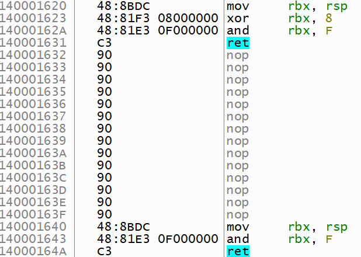

После функций выравнивания вызывается функция пуша параметров Compile_push_parameters_x64.

Пример компиляции вызова функций

In:

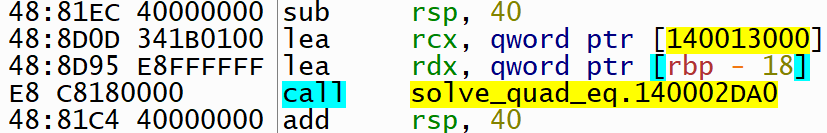

Out:

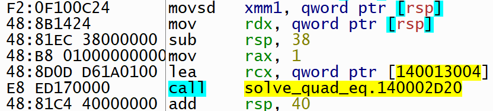

Solve_quad_eq:

Сначала вызывается функция выравнивания, потом Solve_quad_eq

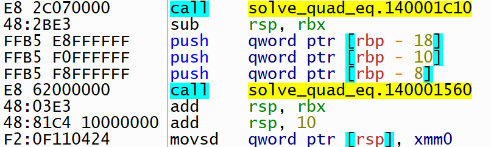

### Ветвления (if)

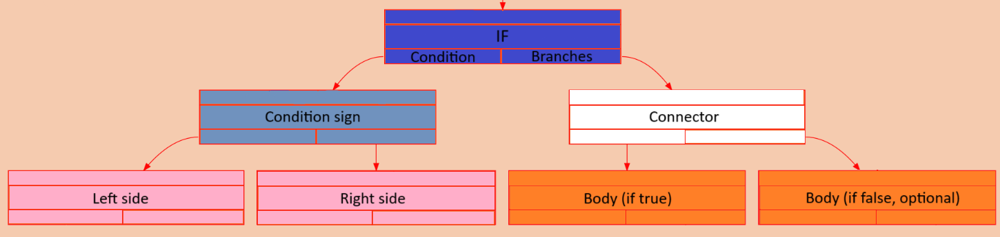

Основа ветвления - условные и безусловные прыжки. Начнем подробно разбирать, как они реализованы в RXcc.

В самом начале Compile_if_x64 вызывается компиляция условия
```c

uint32_t cond_jump_index = Compile_condition_x64(d_array_code, d_array_funcs, condition_root, func_list,
                                                     index, Direct_option);

```

В ней идет компиляция левой и правой частей условия. Затем идет компиляция сравнения

<details>
<summary>Показать реализацию сравнения</summary>

```c

    MOVSD_XREG_MEM_DISP0(d_array_code, I_XMM0, I_RSP);
    ADD_REG_IMM(d_array_code, I_RSP, imm32);
    MOVSD_XREG_MEM_DISP0(d_array_code, I_XMM1, I_RSP);
    ADD_REG_IMM(d_array_code, I_RSP, imm32);
    COMISD_XREG_XREG(d_array_code, I_XMM1, I_XMM0);

```
</details>

После этого с помощью кодогенерации в код заносится подходящий условный jump (файлы [Conditions_code_gen_x64.h](https://github.com/Raptor-X102/Bin_translator/blob/main/headers/Conditions_code_gen_x64.h), [Conditions_code_gen_reverse_x64.h](https://github.com/Raptor-X102/Bin_translator/blob/main/headers/Conditions_code_gen_reverse_x64.h))

<details>
<summary>Показать реализацию кодогенерации jxx</summary>

```c

    if (option == Direct_option) {

        switch (tmp_data->value) {

            #include "Conditions_code_gen_x64.h"

            default:
                DEBUG_PRINTF("ERROR: no such condition\n");
                return Error_value;
        }
    }

    else {

        switch (tmp_data->value) {

            #include "Conditions_code_gen_reverse_x64.h"

            default:
                DEBUG_PRINTF("ERROR: no such condition\n");
                return Error_value;
        }
    }

```
</details>

Reverse_option использовалась в первой версии. Поскольку я думал, что comisd работает как знаковое сравнение, то использовал знаковые прыжки (jl, jge, ...). Однако потом пришлось использовать беззнаковые (jb, jae, ...). Они, к сожалению, не имеют 32-битных аналогов, поэтому это ограничивало прыжок до 256 байт (с учетом знака еще меньше). Поэтому пришлось переделать логику.
Условный оператор теперь компилируется следующим образом:

Когда есть ветвь, если условие ложно
```
условие
comisd xmm1, xmm0
jxx .If_true
jmp .If_false

.If_true:
операции
jmp .Skip_if_false

.If_false:
операции

.Skip_if_false:
```

Когда только истина
```
условие
comisd xmm1, xmm0
jxx .If_true
jmp .If_false

.If_true:
операции

.If_false:
```

В конце Compile_condition_x64 заносится jmp .If_false

<details>
<summary>Показать реализацию jmp .If_false</summary>

```c

    uint32_t fill_address = d_array_code->size + 1; // before we put jmp instr, + 2 cond jmp byte
    Dynamic_array_push_back(d_array_funcs, &fill_address, sizeof(uint32_t));
    Dynamic_array_push_back(d_array_funcs, &disp32, sizeof(int32_t));
    JMP_REL32(d_array_code, No_jmp_rel32);

```
</details>

<details>
<summary>Показать реализацию Compile_if_x64</summary>

```c

bool Compile_if_x64(Dynamic_array* d_array_code, Dynamic_array* d_array_funcs, Node* root,
                    Func_data_list* func_list, int64_t index) {

    Node* condition_root = root->left_node, * body_node = root->right_node;
    uint32_t fill_address = 0;
    int32_t fill_jmp_disp = 0;
    uint32_t cond_jump_index = Compile_condition_x64(d_array_code, d_array_funcs, condition_root, func_list,
                                                     index, Direct_option);
    if (cond_jump_index == Error_value)
        return false;

    if (body_node->left_node)
        if (!Compile_operation_x64(d_array_code, d_array_funcs, body_node->left_node, func_list, index))
            return false;

    if (body_node->right_node) {        // optimization to avoid jump on the next command

        fill_address = d_array_code->size + 1; // before we put jmp instr, + 1 jmp byte
        Dynamic_array_push_back(d_array_funcs, &fill_address, sizeof(uint32_t));
        Dynamic_array_push_back(d_array_funcs, &fill_jmp_disp, sizeof(int32_t));
        JMP_REL32(d_array_code, No_jmp_rel32);
    }

    fill_jmp_disp = -d_array_code->size;
    memcpy(d_array_funcs->data + cond_jump_index, &fill_jmp_disp, sizeof(uint32_t));
    cond_jump_index = d_array_funcs->size - sizeof(int32_t);

    if (body_node->right_node) {
        if (!Compile_operation_x64(d_array_code, d_array_funcs, body_node->right_node, func_list, index))
            return false;

        fill_jmp_disp = -d_array_code->size;
        memcpy(d_array_funcs->data + cond_jump_index, &fill_jmp_disp, sizeof(uint32_t));
    }

    return true;
}

```
</details>

### Цикл (while)

Примеры из [Code_example_dbg.png](https://github.com/Raptor-X102/Bin_translator/tree/main/examples/Debug/Code_example_dbg.png), исходный файл [Code_example.txt](https://github.com/Raptor-X102/Bin_translator/tree/main/examples/Input_data/Code_example.txt).

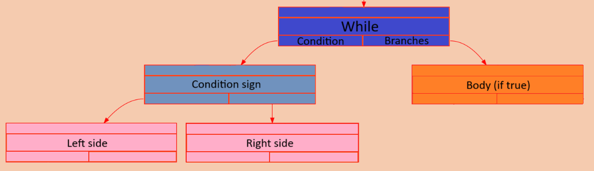

Цикл построен следующим образом

```
.Condition:
условие
comisd xmm1, xmm0
jxx .If_true
jmp .If_false

.If_true:
операции
jmp .Condition

.If_false:
```

<details>
<summary>Показать реализацию Compile_while_x64</summary>

```c

bool Compile_while_x64(Dynamic_array* d_array_code, Dynamic_array* d_array_funcs, Node* root,
                       Func_data_list* func_list, int64_t index) {

    int32_t cond_jump_address = -d_array_code->size;
    uint32_t end_loop_jump_index = Compile_condition_x64(d_array_code, d_array_funcs, root->left_node, func_list,
                                                         index, Direct_option);
    if (end_loop_jump_index == Error_value)
        return false;

    if (root->right_node)
        if (!Compile_operation_x64(d_array_code, d_array_funcs, root->right_node, func_list, index))
            return false;

    uint32_t fill_address = d_array_code->size + 1; // before we put jmp instr, + 1 jmp byte
    int32_t fill_jmp_disp = 0;
    Dynamic_array_push_back(d_array_funcs, &fill_address, sizeof(uint32_t));
    Dynamic_array_push_back(d_array_funcs, &cond_jump_address, sizeof(int32_t));
    JMP_REL32(d_array_code, fill_jmp_disp);

    int32_t end_loop_jump_address = -d_array_code->size;
    memcpy(d_array_funcs->data + end_loop_jump_index, &end_loop_jump_address, sizeof(int32_t));

    return true;
}

```
</details>

Пример компиляции

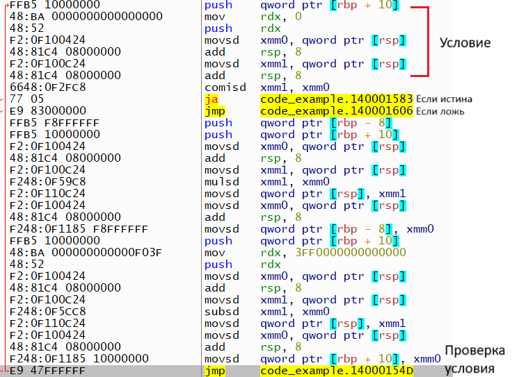

### Присваивание (=)

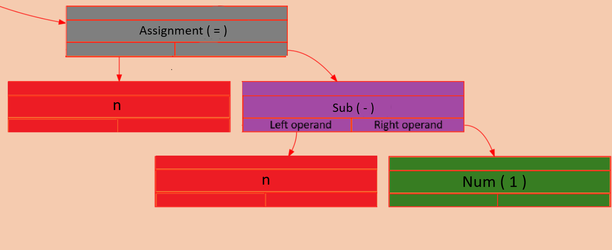

<details>
<summary>Показать реализацию Compile_assignment_x64</summary>

```c

bool Compile_assignment_x64(Dynamic_array* d_array_code, Dynamic_array* d_array_funcs, Node* root, Func_data_list* func_list,
                            int64_t index) {

    Node_data* node_data_left = NULL;
    Variable_data* var_data = NULL;
    int32_t disp32 = 0, imm32 = 8;

    Compile_operator_x64(d_array_code, d_array_funcs, root->right_node, func_list, index);
    MOVSD_XREG_MEM_DISP0(d_array_code, I_XMM0, I_RSP);
    ADD_REG_IMM(d_array_code, I_RSP, imm32);

    assert(root->left_node);
    memcpy(&node_data_left, &root->left_node->node_data, sizeof(Node_data*));
    memcpy(&var_data, &node_data_left->value, sizeof(Variable_data*));
    int64_t var_index = Find_variable(&func_list->func_data[index].local_vars,
                                      var_data->var_name, var_data->var_len);

    if (var_index == -1) {

        //int64_t loc_var_mem_index = func_list->func_data[index].parameters.free_var;
        var_index = Find_variable(&func_list->func_data[index].parameters,
                                  var_data->var_name, var_data->var_len);
        if (var_index == -1) {

            DEBUG_PRINTF("ERROR: variable '%.*s' was not found\n", var_data->var_len, var_data->var_name);
            return false;
        }
        int32_t disp32 = ((var_index + 2)* 8);    // +1 due to return address & RBP in stack
        MOVSD_MEM_XREG(d_array_code, I_RBP, I_XMM0, disp32);
    }

    else {

        int32_t disp32 = -((var_index + 1)* 8);    // +1 due to return address in stack
        MOVSD_MEM_XREG(d_array_code, I_RBP, I_XMM0, disp32);
    }

    return true;
}

```
</details>

Пример компиляции

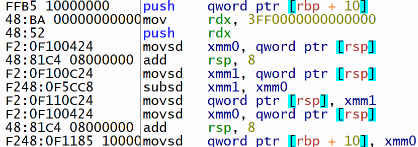


### Вызов функции
Ранее рассказывалось в разделе Операторы, 4. Вызов функции.

### Возращение из функции (return)

Все функции в языке должны возвращать какое-либо значение. Из стека берется возврашщаемое значение и кладется в xmm0. Затем идет эпилог функции в виде leave и ret

<details>
<summary>Показать реализацию Compile_return_x64</summary>

```c

bool Compile_return_x64(Dynamic_array* d_array_code, Dynamic_array* d_array_funcs, Node* root, Func_data_list* func_list,
                        int64_t index) {

    if (root->right_node)
        if (!Compile_operator_x64(d_array_code, d_array_funcs, root->right_node, func_list, index))
            return false;

    int32_t disp32 = 0, imm32 = Value_size;
    MOVSD_XREG_MEM_DISP0(d_array_code, I_XMM0, I_RSP);
    ADD_REG_IMM(d_array_code, I_RSP, imm32);
    LEAVE(d_array_code);
    RET(d_array_code);

    return true;
}

```
</details>

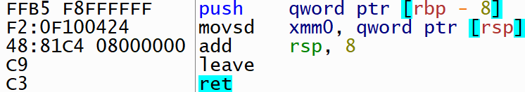


## Создание exe-файла

После того, как все инструкции занесены в массив, мы знаем размер нашего кода. Поэтому теперь мы можем сгенерировать exe-файл нужного размера с помощью ассемблерных вставок nop и gcc. Далее пойдет речь о функциях в файлах [src/Create_main.cpp](https://github.com/Raptor-X102/Bin_translator/blob/main/src/Create_main.cpp) и [src/Main_modification_funcs.cpp](https://github.com/Raptor-X102/Bin_translator/blob/main/src/Main_modification_funcs.cpp).

```c
std_funcs =  Create_main(main_cpp_file, modified_main_cpp_file, &exe_file_name, &file_buffer, &buffer_size,
                             d_array_code.size - Main_prologue_length - Main_epilogue_length);
```

После создания exe-файла нам необходимо найти, где находится функция main. Потому что программа начинается с нее и поменять точку старта вручную задача не из простых. Также найдем относительный адрес функций printf и scanf, а также форматные строки для них.

Это выполняет функции Get_all_funcs_offset, Get_func_offset и Find_main_entry из файла [src/Main_modification_funcs.cpp](https://github.com/Raptor-X102/Bin_translator/blob/main/src/Main_modification_funcs.cpp).

<details>
<summary>Показать реализацию Get_all_funcs_offset</summary>

```c

bool Get_all_funcs_offset(char* file_buffer, size_t file_size,
                          Func_instr_params* func_params_array) {

    if (!Find_main_entry(file_buffer, file_size, func_params_array, Main_entry_index))
        return false;

    if (!Get_func_offset(file_buffer, file_size, func_params_array, Format_string_sf_index))
        return false;

    if (!Get_func_offset(file_buffer, file_size, func_params_array, Format_string_pf_index))
        return false;

    if (!Get_func_offset(file_buffer, file_size, func_params_array, Scanf_index))
        return false;

    if (!Get_func_offset(file_buffer, file_size, func_params_array, Printf_index))
        return false;

    return true;
}

```
</details>

<details>
<summary>Показать реализацию Get_func_offset</summary>

```c

bool Get_func_offset(char* file_buffer, size_t file_size, Func_instr_params* func_params, const int func_index) {

    size_t offset = 0;
    size_t index = 0;
    bool status = false;
    for(; index < file_size - func_params[func_index].bytes_count; index++) {

        if (!memcmp(file_buffer + index, func_params[func_index].bytes_before_func, func_params[func_index].bytes_count)) {

            status = true;
            break;
        }
    }

    if (!status) {

        DEBUG_PRINTF("ERROR: function was not found\n");
        return false;
    }

    else {

        memcpy(&offset, file_buffer + index + func_params[func_index].bytes_count + func_params[func_index].forward_offset,
               func_params[func_index].bytes_to_copy);     // (prev ver. comment)+ 1 = E8 - byte of instruction call rel32
        offset += index + func_params[func_index].bytes_count + func_params[func_index].forward_offset +
                  func_params[func_index].bytes_to_copy - func_params[Main_entry_index].rel_address;
    }

    func_params[func_index].rel_address = offset;

    return true;
}

```
</details>

<details>
<summary>Показать реализацию Find_main_entry</summary>

```c

bool Find_main_entry(char* file_buffer, size_t file_size, Func_instr_params* func_params, const int func_index) {

    size_t offset = 0;
    size_t index = 0;
    bool status = false;
    for(; index < file_size - func_params[func_index].bytes_count; index++) {

        if (!memcmp(file_buffer + index, func_params[func_index].bytes_before_func, func_params[func_index].bytes_count)) {

            status = true;
            break;
        }
    }

    if (!status) {

        DEBUG_PRINTF("ERROR: function was not found\n");
        return false;
    }

    func_params[func_index].rel_address = index + func_params[func_index].forward_offset;

    return true;
}

```
</details>

Их суть заключается в том, что мы заранее знаем, как кодируются все строчки в файле [In_out_mod.cpp](https://github.com/Raptor-X102/Bin_translator/blob/main/In_out_modules/In_out_mod.cpp). Поэтому мы знаем какую последовательность байт искать в коде и какое относительное смещение у адресов, на которые ссылаются инструкции call. Если использовать другие компиляторы и другие флаги оптимизации, то нет гарантии, что скомпилируется такая же последовательность команд. Поэтому найти нужные данные не получится.
После того, как все адреса найдены, они заносятся в структуру Func_instr_params funcs_params.

## Занесение адресов

Теперь, когда мы знаем все относительные адреса функций и джампов, мы можем занести их в наш код. Этим занимается функция Fill_jmp_call_addresses из файла [Backend_funcs_x64.cpp](https://github.com/Raptor-X102/Bin_translator/blob/main/src/Backend_funcs_x64.cpp). Она просто проходится по массиву d_array_funcs и заносит нужные адреса в d_array_code.

<details>
<summary>Показать реализацию Fill_jmp_call_addresses</summary>

```c

void Fill_jmp_call_addresses(Dynamic_array* d_array_code, Dynamic_array* d_array_funcs,
                             Func_data_list* func_list, Func_instr_params* std_funcs) {

    assert(!(d_array_funcs->size % 8));
    for(uint32_t index = 0; index < d_array_funcs->size;) {

        uint32_t address_of_jmp_call = 0;
        int32_t dst_address = 0;
        memcpy(&address_of_jmp_call, &d_array_funcs->data[index], sizeof(uint32_t));
        index += sizeof(uint32_t);
        memcpy(&dst_address, &d_array_funcs->data[index], sizeof(int32_t));
        index += sizeof(uint32_t);

        if (dst_address == Format_string_sf_addr_index) {

            dst_address = std_funcs[Format_string_sf_index].rel_address -
                          address_of_jmp_call - Rel32_code_size;
            memcpy(&d_array_code->data[address_of_jmp_call], &dst_address, sizeof(int32_t));
        }

        else if (dst_address == Format_string_pf_addr_index) {

            dst_address = std_funcs[Format_string_pf_index].rel_address -
                          address_of_jmp_call - Rel32_code_size;
            memcpy(&d_array_code->data[address_of_jmp_call], &dst_address, sizeof(int32_t));
        }

        else if (dst_address == Scanf_func_index) {

            dst_address = std_funcs[Scanf_index].rel_address -
                          address_of_jmp_call - Rel32_code_size;
            memcpy(&d_array_code->data[address_of_jmp_call], &dst_address, sizeof(int32_t));
        }

        else if (dst_address == Printf_func_index) {

            dst_address = std_funcs[Printf_index].rel_address -
                          address_of_jmp_call - Rel32_code_size;
            memcpy(&d_array_code->data[address_of_jmp_call], &dst_address, sizeof(int32_t));
        }

        else if (dst_address < 0) {

            dst_address = -dst_address - address_of_jmp_call - Rel32_code_size;
            memcpy(&d_array_code->data[address_of_jmp_call], &dst_address, sizeof(int32_t));
        }

        else {

            dst_address = func_list->func_data[dst_address].func_rel32_address -
                          address_of_jmp_call - Rel32_code_size;
            memcpy(&d_array_code->data[address_of_jmp_call], &dst_address, sizeof(int32_t));
        }
    }
}

```
</details>

## Перенос кода в exe-файл

Мы ранее уже нашли, где располагается main в нашем exe-файле, поэтому остается только копировать код из d_array_code в нужное место. Реализация Memcpy_safe в [Memcpy_upgrade.cpp](https://github.com/Raptor-X102/Bin_translator/blob/main/libs/Memcpy_upgrade/Memcpy_upgrade.cpp).

```c

Memcpy_safe(file_buffer + std_funcs[Main_entry_index].rel_address, d_array_code.data, d_array_code.size);

```

И дальше записываем получившийся бинарный код в выходной файл

<details>
<summary>Показать реализацию записи в выходной файл</summary>

```c

FILE* exe_output_file = fopen(exe_file_name, "wb");
if (!exe_output_file) {

    DEBUG_PRINTF("ERROR: file was not opened\n");
    return false;
}

fwrite(file_buffer, sizeof(char), buffer_size, exe_output_file);
fclose(exe_output_file);

```
</details>

## Компиляция в nasm

Принцип идентичный, только намного проще работать с метками вместо относительных адресов.
Для создания меток используется счетчик, который увеличивается с каждой созданной меткой.
Подробнее в файлах [Backend_funcs_nasm.cpp](https://github.com/Raptor-X102/Bin_translator/blob/main/src/Backend_funcs_nasm.cpp) и [Backend_funcs_nasm.h](https://github.com/Raptor-X102/Bin_translator/blob/main/headers/Backend_funcs_nasm.h). Примеры скомпилированных файлов в [Programminng_language/other/asm_files](https://github.com/Raptor-X102/Bin_translator/tree/main/examples/compiled/nasm_files)

<details>
<summary>Показать nasm-версию Code_example1.asm</summary>

```nasm

section .data
	fmt_out db "%.3lf", 10, 0
	fmt_in  db "%lf", 0

section .text
	global main
	extern printf
	extern scanf

main:
	PUSH RBP
	MOV RBP, RSP
	SUB RSP, 0x20
	MOV RDX, 0x4024000000000000
	PUSH RDX
	MOVSD XMM0, [RSP]
	ADD RSP, 0x8
	MOVSD [RBP + 0xfffffff8], XMM0
	CALL Check_alignment_odd
	SUB RSP, RBX
	PUSH QWORD [RBP + 0xfffffff8]
	CALL fact
	ADD RSP, RBX
	MOVSD [RSP], XMM0
	MOVSD XMM0, [RSP]
	ADD RSP, 0x8
	MOVSD [RBP + 0xfffffff0], XMM0
	PUSH QWORD [RBP + 0xfffffff0]
	MOVSD XMM1, [RSP]
	MOV RDX, [RSP]
	SUB RSP, 0x38
	MOV RAX, 0x1
	LEA RCX, [REL fmt_out]
	CALL printf
	ADD RSP, 0x40
	MOV RDX, 0
	PUSH RDX
	MOVSD XMM0, [RSP]
	ADD RSP, 0x8
	LEAVE
	RET

fact:
	PUSH RBP
	MOV RBP, RSP
	SUB RSP, 0x20
	MOV RDX, 0x3ff0000000000000
	PUSH RDX
	MOVSD XMM0, [RSP]
	ADD RSP, 0x8
	MOVSD [RBP + 0xfffffff8], XMM0
.L0:
	PUSH QWORD [RBP + 0x10]
	MOV RDX, 0
	PUSH RDX
	MOVSD XMM0, [RSP]
	ADD RSP, 0x8
	MOVSD XMM1, [RSP]
	ADD RSP, 0x8
	COMISD XMM1, XMM0
	JA .L1
	JMP .L2
.L1:
	PUSH QWORD [RBP + 0xfffffff8]
	PUSH QWORD [RBP + 0x10]
	MOVSD XMM0, [RSP]
	ADD RSP, 0x8
	MOVSD XMM1, [RSP]
	MULSD XMM1, XMM0
	MOVSD [RSP], XMM1
	MOVSD XMM0, [RSP]
	ADD RSP, 0x8
	MOVSD [RBP + 0xfffffff8], XMM0
	PUSH QWORD [RBP + 0x10]
	MOV RDX, 0x3ff0000000000000
	PUSH RDX
	MOVSD XMM0, [RSP]
	ADD RSP, 0x8
	MOVSD XMM1, [RSP]
	SUBSD XMM1, XMM0
	MOVSD [RSP], XMM1
	MOVSD XMM0, [RSP]
	ADD RSP, 0x8
	MOVSD [RBP + 0x10], XMM0
	JMP .L0
.L2:
	PUSH QWORD [RBP + 0xfffffff8]
	MOVSD XMM0, [RSP]
	ADD RSP, 0x8
	LEAVE
	RET

Check_alignment_even:
	MOV RBX, RSP
	AND RBX, 0xf
	RET

Check_alignment_odd:
	MOV RBX, RSP
	NEG RBX
	AND RBX, 0xf
	RET


```
</details>

## Главная функция компиляции

Все виды компиляции объединены в функции Compile_func ([Compile_func.cpp](https://github.com/Raptor-X102/Bin_translator/blob/main/src/Compile_func.cpp)). Она проверяет входные файлы и флаги, а также освобождает всю память.
